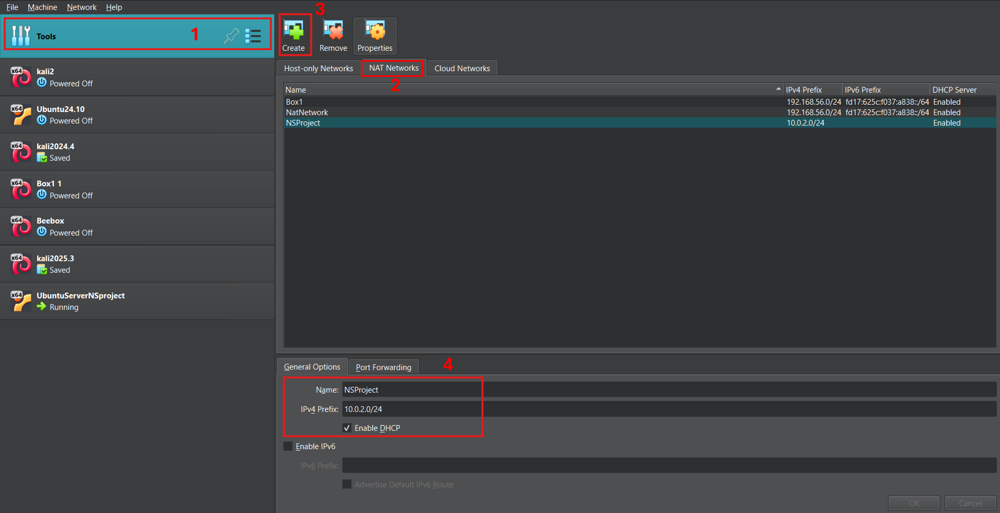
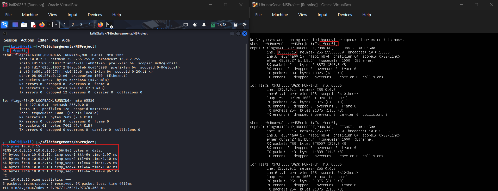
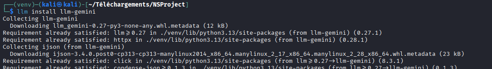
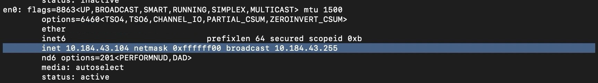

# Architecture

**NOTE** : This section explains how to configure the architecture required for the project.

## How to set up a personal network using Virtual Box?
*(See the example part for more informations)*

Quick overview :
1) Install Virutal Box / VMware
2) Download VMs *(kali, ubuntu, beebox, ...)*
3) Install each box and put them in the same *"Network NAT"*
4) Once each machine has started up, ping them from a VM to ensure that everything is in place
5) Set up llm-nmap in a VM to perform scans  


## Example of a Network (virutal box)

For this network, we used 3 VMs:
- a virtual machine to execute requests through llm-nmap : *kali linux*
- a "classic" target VM : [*Ubuntu Server*](https://ubuntu.com/download/server/thank-you?version=24.04.3&architecture=amd64&lts=true) (to open specific ports) 
- a "vurlnerable" target VM : *bee box* (a VM with many ports already open)

**NOTE** : when you install Ubuntu Server with Virtual Box set your credentials before starting the machine.


To create a Network NAT in Virtual Box :
    - Go to "Tools"
    - Select "NAT Networks"
    - Select "Create"
    - Set up a name and your IP 



Then, add your VMs to the created NAT in *Settings*.


Once done, you can start your VMs and send a ping command to each of them to ensure that they are on the same network.

**NOTE :** on linux, *ifconfig* to show your ip.



## LLM-Nmap Installation

To setup LLM-Nmap we need to install llm in first place :
```
pip install llm
```


For this project we will use gemini as llm *(free api)*:

```
llm install llm-gemini
llm keys set gemini
```

Then to test if everything is working :
```
llm -m gemini-2.0-flash 'Hello'
```



Once done, download [*llm-tools-nmap.py*](https://github.com/peter-hackertarget/llm-tools-nmap) and put it in your projet file

You are ready now :)

Quick tests :

```
llm -m gemini-2.0-flash --functions llm-tools-nmap.py "Scan my local network to find live hosts with ping" 
```


The *Ubuntu Server* is detected by the tool.
Then you can perform some specific scans :
```
llm -m gemini-2.0-flash --functions llm-tools-nmap.py "Make a quick scan of 10.0.2.15"
```


No open ports found.
This result was expeceted as we don't open any ports.

Let's see how to do this.

## Ubuntu Server - Open ports

To open ssh port on Ubuntu Server : 

```
sudo apt update
sudo apt install openssh-server -y
sudo systemctl enable --now ssh
```

Then check if the ssh port (port 22) is open
```
systemctl status ssh
```


Now let's try again LLM-Nmap :


The port 22 is found.

And a quick comparaison with nmap tool :


Your setup is now ready, let's enjoy and play with it !

## Cross-Machine Testing - LLM-Nmap on Colleague's Laptop

In this scenario, we performed testing across different machines on the same WiFi network:
- **Target Machine**: Mac laptop (with open ports)
- **Scanning Machine**: Colleague's laptop (executing Nmap and LLM-Nmap scans on the same network)

### Target Machine - Mac with Open Ports

First, we show the open ports on the Mac machine:


*Figure: Screenshot showing the open ports on the Mac laptop*

Next, we show the IP address of the Mac machine:



*Figure: Screenshot showing the IP address of the Mac laptop*

### Colleague's Laptop - Nmap and LLM-Nmap Scans

The colleague performed both traditional Nmap and LLM-Nmap scans targeting the Mac machine:

**Traditional Nmap Scan Results:**


*Colleague's contribution: Traditional Nmap scan results showing detected ports and services on the Mac*

**LLM-Nmap Scan Results:**


*Colleague's contribution: LLM-Nmap scan results showing the comparison between traditional Nmap and AI-powered scanning*

### Comparison and Analysis

This cross-machine testing demonstrates how LLM-Nmap performs when:
- Running from a different physical machine
- Scanning across a network to a different device
- Identifying and comparing results with traditional Nmap tools