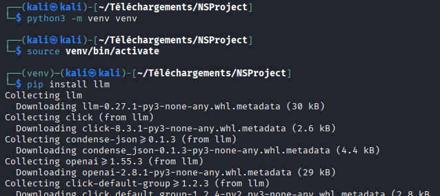
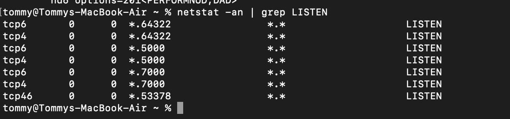
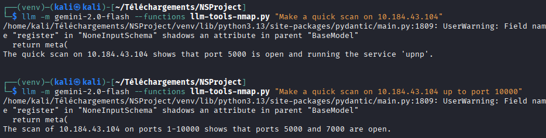

# LLM–Nmap: Network Scanning Using Large Language Models

**Students:**  
- Aurélien Roumégoux  
- Hatem Elashmawy  

**Course:** Network Security – University of Pisa  
**Project:** LLM–Nmap, a network scanning using LLM

---

## Abstract

This report describes the design and implementation of a small framework that integrates Nmap with a Large Language Model (LLM) to perform network scans based on natural-language requests. The framework is built around the `llm` command-line tool, the `llm-tools-nmap.py` plugin, and Google Gemini as the LLM provider, running on a Kali Linux virtual machine inside a VirtualBox lab.

We document how to set up the entire environment, from the virtual network to the LLM configuration, and we present several scenarios where the user describes the desired network analysis to the LLM. The LLM then selects and runs appropriate Nmap commands, the framework collects the scan results, and the output is presented back to the user in a human-readable form. Comparisons with manual Nmap scans are used to validate the correctness of the LLM-driven scans.

---

## 1. Introduction

Nmap is a widely used network scanner that supports a rich set of options, scan types, and output formats. While powerful, it can be difficult for less experienced users to remember the right combination of flags and parameters for a given analysis task.

The goal of this project is to explore how a Large Language Model (LLM) can act as an “interpreter” between a human operator and Nmap. Instead of manually constructing the command line, the user describes the analysis in natural language (e.g., “scan this host and show me which services are running”), and the LLM:

1. Interprets the request,  
2. Chooses an appropriate Nmap function and parameters (using `llm-tools-nmap.py`),  
3. Executes Nmap,  
4. Returns the results and optionally a short summary.

The project specification and the professor’s email define two main requirements:

- Produce a **technical report** that describes how to **set up the entire framework**.
- Provide a **demo** that shows that, when the analysis is described to the LLM, the system:
  1. Correctly configures and runs Nmap,
  2. Acquires the data obtained from Nmap,
  3. Presents the results to the user.

This report addresses these requirements by documenting our architecture, setup steps, scenarios, and a brief evaluation.

---

## 2. Background

### 2.1 Nmap

Nmap is a command-line tool used for network discovery and security auditing. It can perform host discovery, port scanning, service and version detection, and more. Typical usage in our environment involves commands such as:

- `nmap 10.0.2.15` – basic scan of a single host in our NAT network  
- `nmap -sV 10.0.2.15` – service and version detection on the same host  
- `nmap -sn 10.0.2.0/24` – host discovery on the NAT subnet  

In practice, a user must know which flags to use for their goal; this is precisely what we try to offload to the LLM.

### 2.2 LLMs and the `llm` CLI

Large Language Models (LLMs) such as Gemini and GPT can understand and generate text, and can also be integrated with tools via “function calling” or plugins. The `llm` CLI provides:

- A unified command-line interface to multiple LLM providers.
- A plugin system to extend LLMs with custom tools (e.g. Nmap).

In our project, the `llm` CLI acts as the entry point for the user. The user types a natural-language prompt, and `llm` forwards it—together with the function definitions from `llm-tools-nmap.py`—to Gemini.

### 2.3 `llm-tools-nmap.py`

The `llm-tools-nmap.py` plugin defines one or more “functions” that the LLM can call when it decides that a network scan is needed. Each function corresponds to a certain Nmap operation (e.g. a “quick scan” or a “ping scan”).

When the user prompt suggests a scan (for example, “Scan my local network to find live hosts with ping”), the LLM chooses the appropriate function, provides arguments (target, scan type), and the plugin executes Nmap and returns the output. That output is then included in the final LLM response shown to the user.

---

## 3. System Architecture and Environment

### 3.1 Overview

Our architecture is based on a small VirtualBox lab plus one physical host:

- **Kali Linux VM** (controller):
  - Runs the `llm` CLI.
  - Uses Google Gemini via `llm-gemini`.
  - Loads `llm-tools-nmap.py` to connect the LLM to Nmap.
  - Executes all Nmap scans.

- **Ubuntu Server VM**:
  - “Classic” target with specific services (e.g. SSH) that we can enable/disable.
  - Used to demonstrate how open ports appear or disappear in the scans.

- **BeeBox VM**:
  - Vulnerable target with many open ports and services by default.
  - Used as a richer scenario to show how LLM–Nmap behaves on a more complex target.

- **Mac laptop (physical)**:
  - Physical host on the same network.
  - Used to show that the framework is not limited to virtual machines, as long as the target is reachable and we have permission to scan it.

### 3.2 VirtualBox Network Setup

We use a **VirtualBox NAT Network** so that the VMs can communicate with each other on a private subnet.

#### 3.2.1 Creating a NAT Network

1. Open VirtualBox.  
2. Go to **Tools → NAT Networks**.  
3. Click **Create** and configure:
   - A name (e.g. `NSProject`),
   - An IP range (e.g. `10.0.2.0/24`).


#### 3.2.2 Attaching VMs to the NAT Network

For each VM (Kali, Ubuntu Server, BeeBox):

1. Open **Settings → Network**.  
2. Set **Attached to** = `NAT Network`.  
3. Select the NAT network created earlier (`NSProject`).


#### 3.2.3 Verifying Connectivity

On each VM, retrieve its IP address:

```bash
ifconfig
```

From the Kali VM, test reachability:

```bash
ping 10.0.2.15       # Ubuntu Server in our example
```


```bash
ping 10.0.2.7        # Beebox in our example
```


If the pings succeed, the VMs are on the same network and reachable.

### 3.3 Roles of Each Machine

- **Kali VM**:  
  Runs LLM–Nmap (LLM + `llm-tools-nmap.py` + Nmap). Used to issue all LLM-driven scans and manual Nmap scans.

- **Ubuntu Server VM**:  
  Initially has no open services; then we install and enable `openssh-server`. Allows us to show the difference between “no open ports” and “port 22 open” on **10.0.2.15**.

- **BeeBox VM**:  
  Has many open ports and vulnerable services by design. Used to generate more complex Nmap outputs (Scenario 3).

- **Mac laptop**:  
  Serves as an external target reachable from the Kali VM. Demonstrates that the framework works across a real network.

---

## 4. LLM–Nmap Setup on Kali
*NOTE: For the following part, we will only use the Ubuntu Server as a target, but it also works for the Beebox VM or any VM/real computer you use.*

This section describes the concrete steps to configure the LLM–Nmap framework on the Kali VM.

### 4.1 Installing `llm`

On Kali, create a virtual environment and install *llm*:

```bash
python3 -m venv <name of your venv> # create a virtual environment

source <name of your venv>/bin/activate  # activate the virtual environment

pip install llm # install llm
```



### 4.2 Configuring Gemini

With *llm* we can use a lot of different llms such as ChatGPT or Gemini. Wed decided to use Google Gemini as the LLM provider because the API is available for free.

1. Install the Gemini plugin:

   ```bash
   llm install llm-gemini
   ```

2. Set the Gemini API key (obtained from [Google AI Studio](https://aistudio.google.com/)):

   ```bash
   llm keys set gemini
   ```

3. Test Gemini:

   ```bash
   llm -m gemini-2.0-flash "Hello"
   ```


If a valid text response is returned, the LLM configuration is working.

### 4.3 Adding `llm-tools-nmap.py`

To perform a request to Nmap through an LLM, we need to add the Python tool *llm-tools-nmap.py*:

1. Download `llm-tools-nmap.py` from the reference repository:  
   <https://github.com/peter-hackertarget/llm-tools-nmap>
2. Place the file (e.g.) in `/home/kali/LLM-Nmap/` or in your project directory on Kali.
3. From that directory, run a first test:

   ```bash
   llm -m gemini-2.0-flash --functions llm-tools-nmap.py \
       "Scan my local network to find live hosts with ping"
   ```


In our setup, the **Ubuntu Server** VM is detected by the tool.
*NOTE: The Beebox isn't detected because the VM was shut down when the screenshot was taken.*

Then, we perform a more specific scan of the Ubuntu Server at IP **10.0.2.15**:

```bash
llm -m gemini-2.0-flash --functions llm-tools-nmap.py \
    "Make a quick scan of 10.0.2.15"
```


At this stage, no open ports are found. This is expected, because we have not yet enabled any service on the Ubuntu Server.

---

## 5. Scenarios and Implementation Details

We implemented and tested three main scenarios to demonstrate the behaviour of LLM–Nmap.

### 5.1 Scenario 1 – Kali VM Scanning Ubuntu Server VM (10.0.2.15)

#### 5.1.1 Opening SSH on Ubuntu Server

We previously saw that no ports were open. Let's open a port (e.g. SSH) to see if it will be detected by llm-nmap.

On the Ubuntu Server VM (10.0.2.15):

```bash
sudo apt update
sudo apt install openssh-server -y
sudo systemctl enable --now ssh
systemctl status ssh
```


After this, port **22/tcp** should be open on 10.0.2.15.

#### 5.1.2 LLM–Nmap Scan After Enabling SSH

We re-run the quick scan from Kali:

```bash
llm -m gemini-2.0-flash --functions llm-tools-nmap.py \
    "Make a quick scan of 10.0.2.15"
```


Port **22/tcp** is now detected as open.

#### 5.1.3 Comparison with Manual Nmap

To validate the result, we run a manual Nmap scan from Kali:

```bash
nmap 10.0.2.15
```


The manual output confirms that port 22 is open and identifies the SSH service.  
This verifies that:

- The LLM correctly configured and executed Nmap via the plugin, and  
- The data presented by LLM–Nmap is consistent with the “ground truth”.

---

### 5.2 Scenario 2 – Kali VM Scanning a Physical Mac Host (10.184.43.104)

In this scenario, Kali runs as a VM on one laptop, and the target is a Mac laptop on the same Wi-Fi network.

#### 5.2.1 Target: Mac Host

On the Mac, we identify:

- The IP address (shown in the screenshot).
- The open ports (e.g. enabled services).


*Figure: Screenshot showing the open ports on the Mac laptop*


*Figure: Screenshot showing the IP address of the Mac laptop*

#### 5.2.2 Nmap and LLM–Nmap Scans from Kali

From the Kali VM, we run:

Manual scan:

```bash
nmap -A 10.184.43.104
```

*Traditional Nmap scan results showing detected ports and services on the Mac*

LLM-driven scan:

```bash
llm -m gemini-2.0-flash --functions llm-tools-nmap.py \
    "Scan <mac-ip> and show me which ports are open and what services are running"
```


*LLM–Nmap scan results showing the comparison between traditional Nmap and AI-powered scanning*

#### 5.2.3 Observations

- LLM–Nmap successfully runs from a virtual machine and scans a **physical device** on the same network.
- The set of open ports and services matches the manual Nmap scan and the expected services on the Mac.
- This shows that the architecture is not limited to intra-VM scans; any reachable host can be scanned, as long as it is in scope and legally allowed.

---

### 5.3 Scenario 3 – Kali VM Scanning BeeBox (Vulnerable Target) (10.0.2.7)

BeeBox is a deliberately vulnerable VM with many open ports and insecure applications.

#### 5.3.1 Host Discovery Including BeeBox

From Kali:

```bash
llm -m gemini-2.5-flash --functions llm-tools-nmap.py \
    "Scan my local network to find live hosts with ping"
```

BeeBox should appear as one of the live hosts in the output.


#### 5.3.2 Service Enumeration on BeeBox

Next, let's start with a basic scan using llm :

```bash
llm -m gemini-2.5-flash --functions llm-tools-nmap.py "Make a quick scan of 10.0.2.7"
```


The scan found 13 different open ports.

#### 5.3.3 Comparison with Manual Nmap

Let's compare with a manual scan:

```bash
nmap 10.0.2.7
```


The scan through Nmap reveals that 17 ports were open.

So, with the basic instructions, llm-nmap didn't succeed in finding all open ports (4 are missing compared to Nmap).

Let's try to challenge llm-nmap with a more complex prompt.

#### 5.3.4 Challenging llm-nmap

We saw that the basic prompt with llm-nmap wasn't enough to find every open port.

Let's just make a simple change, changing "quick" to "deep" and see the results.

```bash
llm -m gemini-2.5-flash --functions llm-tools-nmap.py "Make a quick deep of 10.0.2.7"
```


This request took longer to complete but provided better results (similar to using the -A option with Nmap).
All ports that the "basic" Nmap request found were found.

We can also use llm-nmap to ask it to perform tasks that Nmap can't do, such as generating reports.
Since we are in a security context, let's combine the scanning request with security report generation :

```bash
llm -m gemini-2.5-flash --functions llm-tools-nmap.py "Make a quick scan of 10.0.2.7 and make me a report of the result. Highlight network vulnerabilities."
```
*NOTE: We requested a "quick" scan to get results faster than a "deep" scan.* 


We obtained a complete cybersecurity report including the open ports found, potential risks, and recommendations to improve the security of our network.

---

## 6. Evaluation and Discussion

### 6.1 Does the Framework Meet the Project Goals?

The project goals from the professor’s email are:

1. **Describe how to set up the entire framework**  
   - Sections 3 and 4 of this report document the full setup:
     - VirtualBox NAT network and VMs.
     - Installation of `llm`, Gemini, and `llm-tools-nmap.py` on Kali.
   - These steps are sufficient for another student to reproduce our environment.

2. **Demo: “description → configuration and execution → data acquisition → presentation”**  
   - In all three scenarios, the interaction pattern is:
     - We describe the analysis in natural language (e.g. “Make a quick scan of 10.0.2.15”, “Scan the NAT network and list all live hosts”).
     - The LLM chooses the appropriate Nmap function and parameters via `llm-tools-nmap.py`.
     - Nmap is executed on the Kali VM.
     - The Nmap output is included in the LLM response and presented to the user.
   - Manual Nmap scans serve as a reference to confirm correctness.

Therefore, the implemented framework satisfies the requested workflow.

### 6.2 Advantages

- **Ease of use:**  
  Users can describe what they want to do instead of remembering Nmap syntax (No need to know the different parameters: -A, -s, -V, -p, -n ...)

- **Flexibility:**  
  Users can use llm-nmap to perform complex tasks that Nmap cannot (such as explaining ports, generating reports, and more.)

### 6.3 Limitations

- **Dependence on the LLM:**  
  The quality of the chosen scan depends on the LLM. It may sometimes select suboptimal flags or misinterpret ambiguous prompts.
  
- **Inconsistent for the same request:**
  Since it uses an LLM, the quality of the responses is random and inconsistent. Examples with a short and a complex answer for the same request :
  
  

- **No answer:**
  Sometimes llm-nmap doesn't respond to a request and instead replies with a question.
  


### 6.4 Difficulties encountered during the project

For this project, we were limited to using an older Gemini model, as it is the only one with a free API. We were unable to test llm-nmap on newer LLMs, but we can expect their responses - especially for secondary tasks - to be more accurate and consistent.

Additionally, as free API users, we were constrained by the number of requests we could make.


---

## 7. Conclusion and Future Work

In this project, we built and evaluated a framework that combines Nmap with an LLM using the `llm` CLI and the `llm-tools-nmap.py` plugin. The system allows a user to describe a desired network analysis in natural language and have the LLM:

1. Configure and execute the appropriate Nmap command,  
2. Collect the scan results,  
3. Present the findings in a human-readable format.

We implemented a small VirtualBox lab with Kali, Ubuntu Server, and BeeBox, and we also tested scans against a physical Mac host. Across all scenarios, LLM–Nmap produced results consistent with manual Nmap scans, demonstrating that the approach is feasible and practical for small-scale environments.

Possible extensions include:

- Adding more strict safety constraints (e.g. whitelisting targets, limiting scan types).
- Parsing Nmap XML output to build structured reports or dashboards.
- Integrating additional security tools (e.g. vulnerability scanners) as LLM “functions” alongside Nmap.
- Comparing behaviour and quality across different LLM providers (e.g. Gemini vs GPT vs Claude) using the same plugin.

Overall, the project confirms that LLMs can make network scanning more accessible by bridging between natural language and powerful but complex tools like Nmap.

---